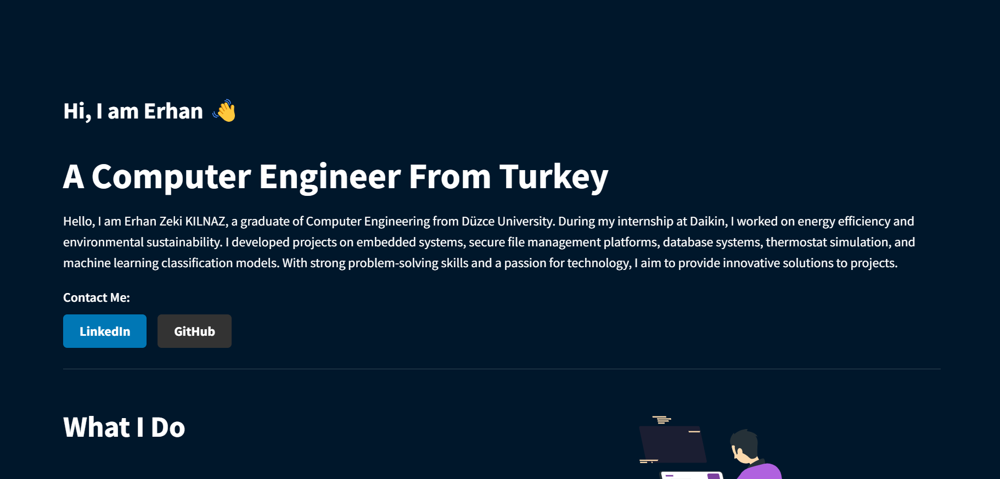

# Personal Webpage with Streamlit

This project creates a personal portfolio webpage using Streamlit to showcase projects, skills, and contact information. The page is interactive, lightweight, and can be easily deployed.

Link: https://erhan-kilnaz-cv.streamlit.app/
## Features

- **Responsive Layout**: Uses Streamlit's container and column layout for a clean and responsive design.
- **Lottie Animations**: Integrated with Lottie animations for an engaging user experience.
- **Projects Showcase**: Displays a list of projects with images and descriptions.
- **Custom Styling**: Local CSS is used for custom styles, making the page more visually appealing.
- **Contact Form**: A functional contact form allows visitors to send messages directly to your email.

## Technologies Used

- **Streamlit**: For building and deploying the web application.
- **Python**: The core programming language.
- **Lottie Animations**: For adding interactive animations.
- **Pillow (PIL)**: To handle and display images.
- **HTML/CSS**: For custom styling and structuring.

## How to Run

1. Clone the repository:
    ```bash
    git clone https://github.com/ErhanKlnz/Erhan-Kilnaz-CV.git
    ```

2. Install the required dependencies:
    ```bash
    pip install -r requirements.txt
    ```

3. Run the Streamlit application:
    ```bash
    streamlit run app.py
    ```

4. Open your browser at `http://localhost:8501` to view the webpage.


## Screenshots



## Contact

For any inquiries, please contact [Erhan Zeki KILNAZ](mailto:erhanzekikilnaz@hotmail.com).


